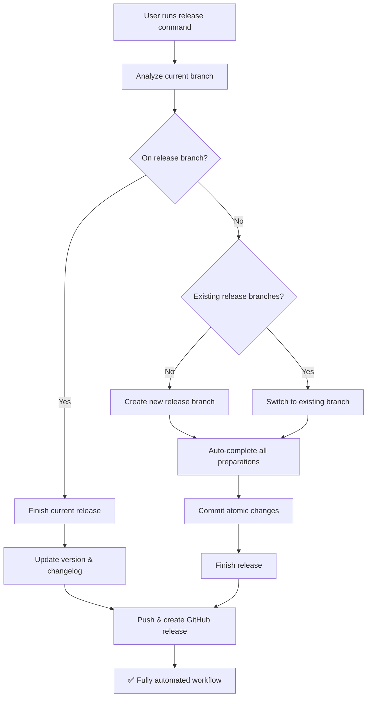

# Release Management

Gitflow release operations based on current branch state and semantic versioning.

## Workflow



## Branch-based Logic

### If on release branch
**Automatically executes:**
- Analyzes current release state
- Updates version and changelog
- Runs quality checks (lint/build)
- Merges to main/develop
- Creates GitHub release
- Pushes all changes and tags

### If not on release branch
**Analyzes and decides automatically:**
- **No release branches**: Creates new release → completes all preparations → finishes release
- **Branch exists**: Switches to existing → completes preparations → finishes release

## Operations

### Automated Operations

**All operations are fully automated:**

```bash
# Automated Decision Tree - No manual intervention
# 1. Analyze current state
# 2. Detect semantic version from commits
# 3. Create/switch to appropriate branch
# 4. Run all quality checks
# 5. Update all documentation and versions
# 6. Make atomic conventional commits  
# 7. Finish release and create GitHub release
# 8. Push everything to remote

# Example execution sequence:
git flow release start [detected-version]
git flow release publish [detected-version]
# Runs: lint, build, version updates, changelog
# Commits: chore: update version, docs: update changelog
git flow release finish [detected-version]
git push origin main develop --tags
gh release create v[detected-version] --title "Release [version]" --latest
```

## Automated Release Preparation

### Version Management
- Automatically detect current version from git tags
- Analyze commits since last release:
  - **BREAKING CHANGE** or `feat!`/`fix!` → major bump
  - `feat:` commits → minor bump  
  - `fix:` commits → patch bump
- Update package.json/pyproject.toml/Cargo.toml if present

### Quality Checks
- Run lint checks (if lint script exists)
- Run build checks (if build script exists)
- Fail release if checks don't pass

### Documentation Updates
- Generate/update CHANGELOG.md from commit history since last release
- Include commit messages, authors, and dates
- Group by commit type (feat, fix, chore, etc.)

### Atomic Commits
- **Separate commits** for each logical change:
  - `chore: update version to x.y.z`
  - `docs: update changelog for x.y.z release`
- **Commit requirements**:
  - Title entirely lowercase
  - Under 50 characters
  - Follow conventional commits format
  - Atomic units of work

## Usage
```bash
# User simply runs:
release

# Executes complete autonomous workflow:
# 1. Analyze branch state and git history
# 2. Determine semantic version bump from commits
# 3. Decide optimal release strategy (new/continue/finish)
# 4. Create/switch to appropriate release branch
# 5. Run comprehensive quality checks
# 6. Update all version files and generate changelog
# 7. Make atomic conventional commits
# 8. Finish release and create GitHub release
# 9. Push all changes to remote repositories
# 10. ✅ Complete - zero manual steps required

# Makes all decisions based on:
# - Current branch state
# - Commit history analysis  
# - Branch age calculations
# - Semantic versioning rules
# - Repository conventions
```

## Best Practices
- Use conventional commits for automatic version detection  
- Test thoroughly on release branch before finishing
- Coordinate release timing with team
- Sync dependencies before finishing releases