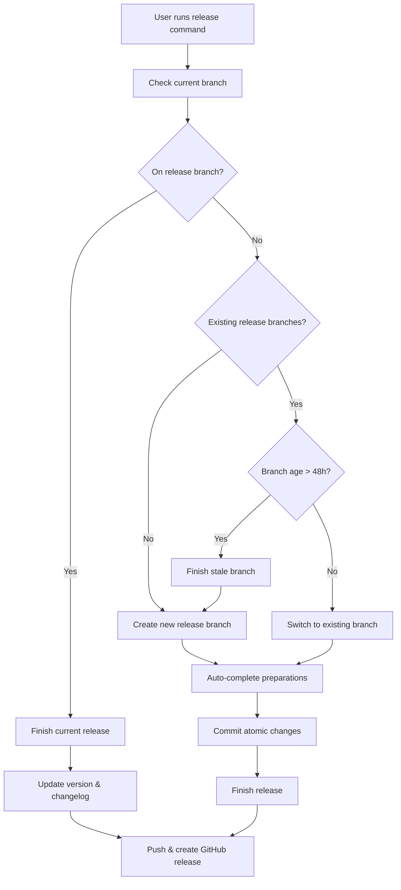

# Release Management

Gitflow release operations based on current branch state and semantic versioning.

## Workflow



## Branch-based Logic

### If on release branch
- Finish the current release
- Update version and changelog
- Merge to main/develop
- Create GitHub release
- Push all changes and tags

### If not on release branch
**Check for existing release branches:**
- **None found**: Create new release branch → auto-complete preparations → finish release
- **Branch exists < 48h**: Switch to existing branch → auto-complete preparations → finish release
- **Branch exists > 48h**: Finish stale branch → create new branch → auto-complete preparations → finish release

## Operations

### Finish Release
```bash
git flow release finish [version]
git push origin main develop --tags
gh release create v[version] --title "Release [version]" --latest
```

### Create New Release
```bash
# Auto-detect semantic version bump from commits
git flow release start [new-version]
git flow release publish [new-version]

# Automatically complete release preparations:
# 1. Run lint and build checks (if applicable)
# 2. Update/create CHANGELOG.md from commit history
# 3. Update version in package management files
# 4. Commit changes with conventional commit format

# Then automatically finish release
git flow release finish [new-version]
gh release create v[new-version] --title "Release [new-version]" --latest
```

### Continue Existing
```bash
git checkout release/[version]
# Same automated preparation process applies
```

## Automated Release Preparation

### Version Management
- Automatically detect current version from git tags
- Analyze commits since last release:
  - **BREAKING CHANGE** or `feat!`/`fix!` → major bump
  - `feat:` commits → minor bump  
  - `fix:` commits → patch bump
- Update package.json/pyproject.toml/Cargo.toml if present

### Quality Checks
- Run lint checks (if lint script exists)
- Run build checks (if build script exists)
- Fail release if checks don't pass

### Documentation Updates
- Generate/update CHANGELOG.md from commit history since last release
- Include commit messages, authors, and dates
- Group by commit type (feat, fix, chore, etc.)

### Atomic Commits
- **Separate commits** for each logical change:
  - `chore: update version to x.y.z`
  - `docs: update changelog for x.y.z release`
- **Commit requirements**:
  - Title entirely lowercase
  - Under 50 characters
  - Follow conventional commits format
  - Atomic units of work

## Usage
```bash
# User modifies code, then runs:
release

# Command executes full automated workflow:
# 1. Analyze branch state and determine action
# 2. Create/switch to release branch
# 3. Run quality checks (lint, build)
# 4. Update version files and changelog
# 5. Make atomic conventional commits
# 6. Finish release and create GitHub release
# 7. No manual intervention required
```

## Best Practices
- Keep release branches short-lived (< 48h)
- Use conventional commits for automatic version detection  
- Test thoroughly on release branch before finishing
- Coordinate release timing with team
- Sync dependencies before finishing releases