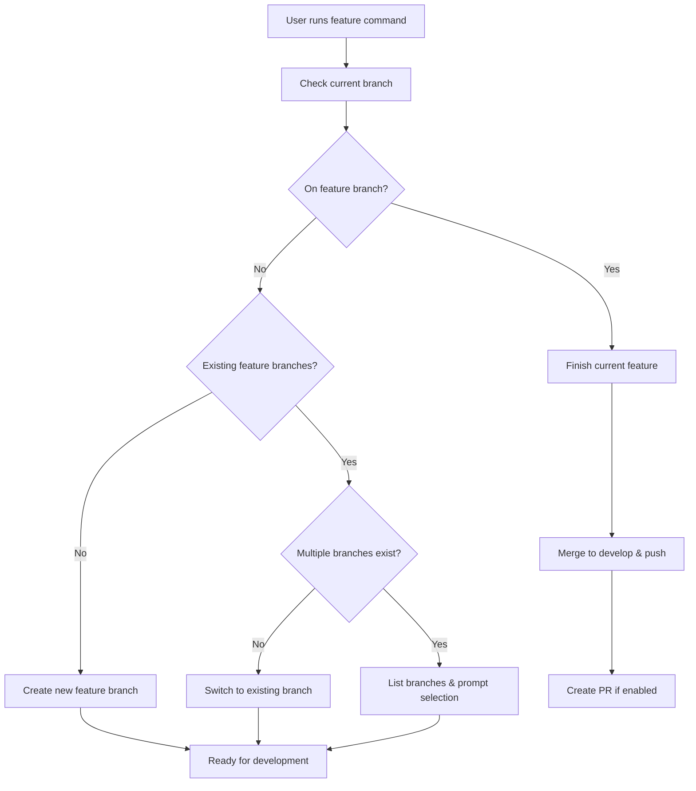

# Feature Management

Gitflow feature operations based on current branch state.

## Workflow



## Branch-based Logic

### If on feature branch
- Finish the current feature
- Merge to develop branch
- Push all changes
- Optionally create pull request

### If not on feature branch
**Check for existing feature branches:**
- **None found**: Create new feature branch with descriptive name
- **Single branch**: Switch to existing branch for continued work
- **Multiple branches**: List all feature branches and prompt for selection

## Operations

### Finish Feature
```bash
git flow feature finish [feature-name]
git push origin develop
gh pr create --title "feat: [feature-name]" --base develop
```

### Create New Feature
```bash
# Auto-generate descriptive name or prompt user
git flow feature start [feature-name]
git flow feature publish [feature-name]
```

### Continue Existing Feature
```bash
git checkout feature/[feature-name]
git pull origin feature/[feature-name]
```

## Feature Name Generation
- Automatically detect current work context from recent commits
- Use kebab-case naming: `user-authentication`, `payment-integration`
- Fallback to prompt user for descriptive name

## Usage
```bash
# User modifies code, then runs:
feature

# Command analyzes branch state and executes appropriate action
# No additional parameters needed - fully autonomous
```

## Best Practices
- Keep features small and focused (< 500 lines of code)
- Use conventional commits (feat:, fix:, chore:)
- Commit message titles must be lowercase and < 50 characters
- Write tests before finishing features
- Regular commits with atomic, logical units of work