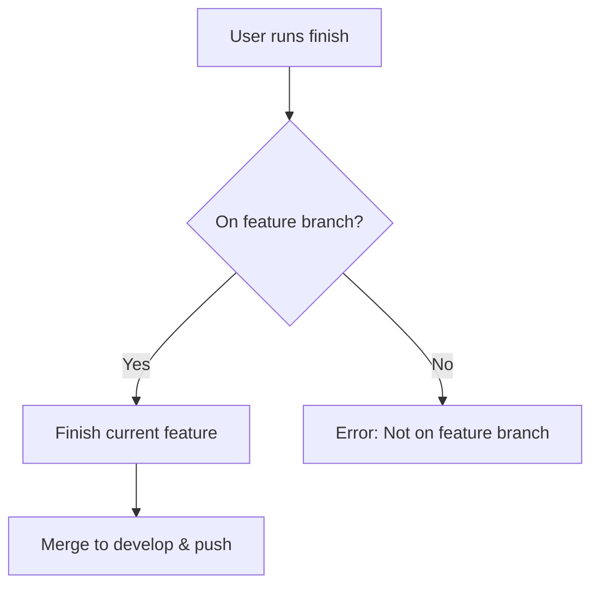

# Finish GitFlow Feature

Complete and merge current feature development.

## Workflow



## Prerequisites
- Must be on a feature branch (feature/*)
- All changes should be committed
- Tests should pass before finishing

## Operations

### Finish Feature
```bash
# Merges feature branch to develop and deletes feature branch
git flow feature finish [feature-name]
git push origin develop
```

## Process Steps
1. **Validate current branch** - Ensure user is on a feature branch
2. **Run pre-finish checks** - Verify all changes are committed
3. **Merge to develop** - Use git flow feature finish (automatically merges and deletes feature branch)
4. **Push changes** - Push develop branch to origin

## Git-Flow Integration
- `git flow feature finish` automatically merges to develop
- Feature branch is deleted after successful merge
- No pull request needed as merge is direct

## Error Handling
- **Not on feature branch**: Display error and suggest using start
- **Uncommitted changes**: Prompt user to commit or stash changes
- **Merge conflicts**: Guide user through conflict resolution

## Best Practices
- Run tests before finishing features
- Ensure all changes are committed
- Use descriptive commit messages following conventional commits
- Keep feature branches focused and small (< 500 lines of code)
- Review code changes before finishing
