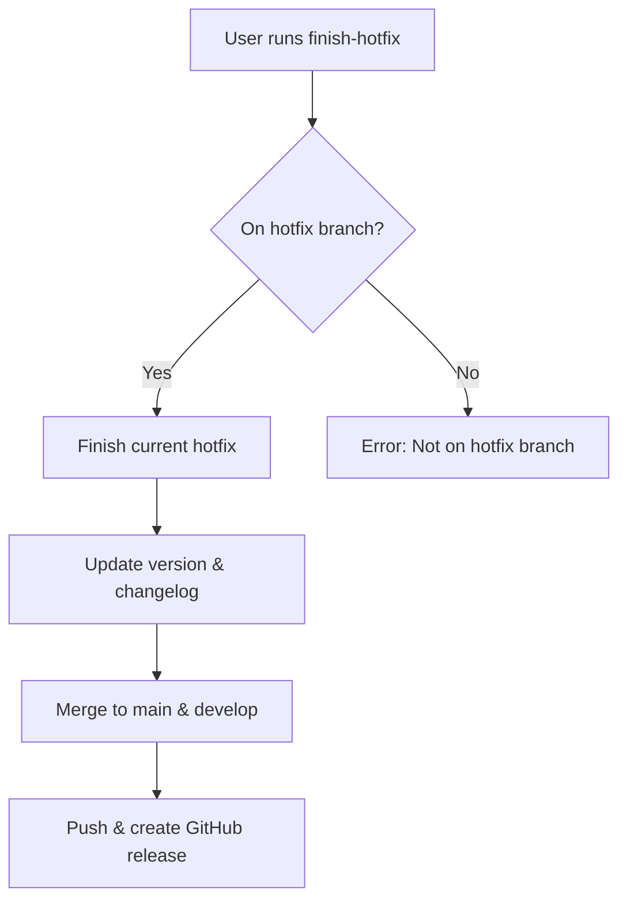

# Finish GitFlow Hotfix

Complete and merge current hotfix development.

## Workflow



## Prerequisites
- Must be on a hotfix branch (hotfix/*)
- All changes should be committed
- Tests should pass before finishing

## Operations

### Finish Hotfix
```bash
# Merges to both main and develop, creates tag, deletes hotfix branch
git flow hotfix finish [version]
git push origin main develop --tags
gh release create v[version] --title "Hotfix [version]" --latest
```

## Process Steps
1. **Validate current branch** - Ensure user is on a hotfix branch
2. **Run pre-finish checks** - Verify all changes are committed
3. **Update version** - Update package.json/pyproject.toml if present
4. **Add changelog entry** - Add entry with current date
5. **Merge to main/develop** - Use git flow hotfix finish (automatically merges to both branches)
6. **Push changes** - Push main, develop branches and tags to origin
7. **Create GitHub release** - Create release with version tag

## Git-Flow Integration
- `git flow hotfix finish` merges to both main and develop branches
- Automatically creates a version tag
- Hotfix branch is deleted after successful merge
- Ensures hotfix is available in both production and development branches

## Error Handling
- **Not on hotfix branch**: Display error and suggest using start-hotfix
- **Uncommitted changes**: Prompt user to commit or stash changes
- **Merge conflicts**: Guide user through conflict resolution

## Best Practices
- Run tests before finishing hotfix
- Ensure all changes are committed
- Use descriptive commit messages following conventional commits
- Keep hotfixes focused on critical fixes only
- Coordinate hotfix timing with team