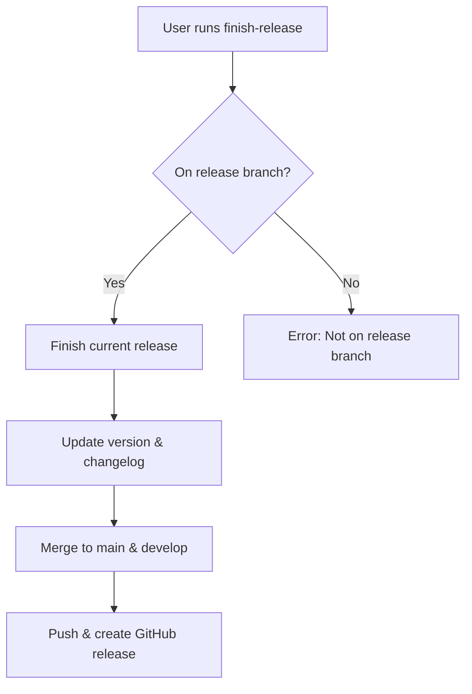

# Finish GitFlow Release

Complete and merge current release development.

## Workflow



## Prerequisites
- Must be on a release branch (release/*)
- All changes should be committed
- Tests should pass before finishing
- All features for release should be complete

## Operations

### Finish Release
```bash
# Merges to main/develop, creates tag, and deletes release branch
git flow release finish [version]
git push origin main develop --tags
gh release create v[version] --title "Release [version]" --latest
```

## Process Steps
1. **Validate current branch** - Ensure user is on a release branch
2. **Run pre-finish checks** - Verify all changes are committed
3. **Update version** - Update package.json/pyproject.toml/Cargo.toml if present
4. **Add changelog entry** - Add entry with current date
5. **Merge to main/develop** - Use git flow release finish (automatically creates tag)
6. **Push changes** - Push main, develop branches and tags to origin
7. **Create GitHub release** - Create release with version tag

## Git-Flow Integration
- `git flow release finish` merges to both main and develop
- Automatically creates a version tag
- Release branch is deleted after successful merge

## Error Handling
- **Not on release branch**: Display error and suggest using start-release
- **Uncommitted changes**: Prompt user to commit or stash changes
- **Merge conflicts**: Guide user through conflict resolution
- **Failed tests**: Block release until tests pass

## Best Practices
- Run full test suite before finishing release
- Ensure all changes are committed
- Use descriptive commit messages following conventional commits
- Keep releases focused and well-tested
- Coordinate release timing with team
- Review all changes before finishing
- Update documentation if needed