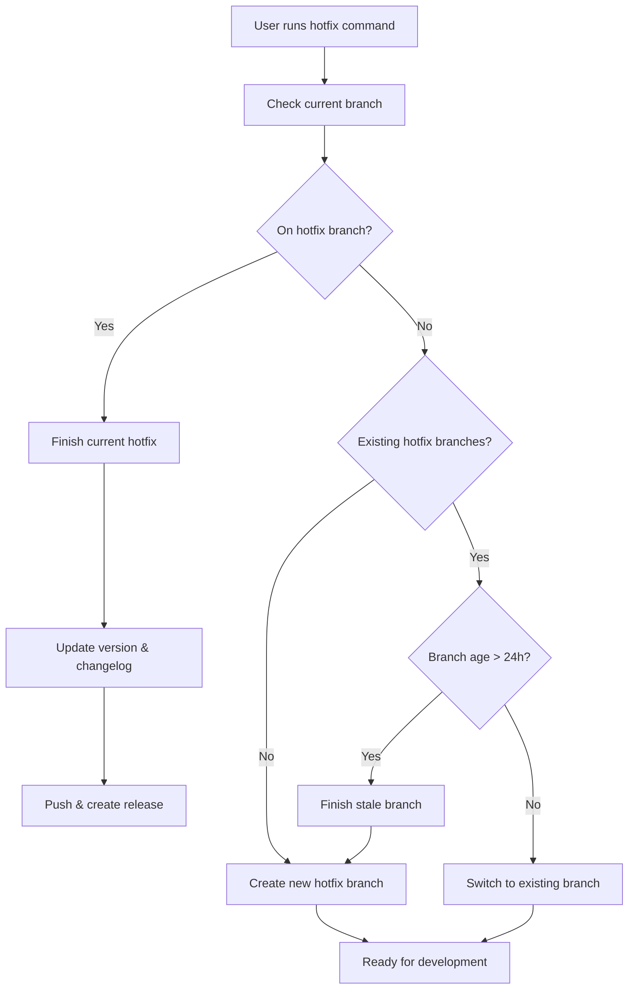

# Hotfix Management

Gitflow hotfix operations based on current branch state.

## Workflow



## Branch-based Logic

### If on hotfix branch
- Finish the current hotfix
- Update version and changelog
- Merge to main/develop
- Create GitHub release
- Push all changes and tags

### If not on hotfix branch
**Check for existing hotfix branches:**
- **None found**: Create new hotfix branch with incremented patch version
- **Branch exists < 24h**: Switch to existing branch for continued work
- **Branch exists > 24h**: Finish stale branch, then create new one

## Operations

### Finish Hotfix
```bash
git flow hotfix finish [version]
git push origin main develop --tags
gh release create v[version] --title "Hotfix [version]" --latest
```

### Create New Hotfix
```bash
# Auto-increment patch version from latest tag
git flow hotfix start [new-version]
git flow hotfix publish [new-version]
```

### Continue Existing
```bash
git checkout hotfix/[version]
```

## Version Management
- Automatically detect current version from git tags
- Increment patch version (1.2.3 → 1.2.4)
- Update package.json/pyproject.toml if present
- Add changelog entry with current date

## Usage
```bash
# User modifies code, then runs:
hotfix

# Command analyzes branch state and executes appropriate action
# No additional parameters needed - fully autonomous
```