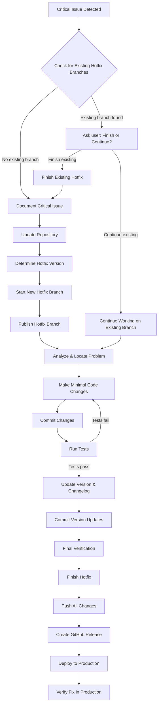

# Git Flow Hotfixes

Commands for managing critical production fixes following GitHub best practices.

## Overview

Hotfixes are critical production fixes that bypass normal development workflow to address urgent issues. This document provides comprehensive guidance for managing hotfixes using Git Flow methodology.

## Hotfix Workflow Diagram



## Quick Reference

### Essential Commands
- `git branch -a | grep hotfix` - Check for existing hotfix branches
- `git flow hotfix start VERSION` - Start new hotfix
- `git flow hotfix publish VERSION` - Publish hotfix branch
- `git flow hotfix finish VERSION` - Complete hotfix workflow

### Critical Requirements
- ⚠️ **Always check for existing hotfix branches first**
- 🔒 **Make minimal, targeted changes only**
- 📝 **Update version and changelog BEFORE finishing**
- 🧪 **Test thoroughly but quickly**
- 🚀 **Deploy immediately after completion**

---

# AI Instructions for Hotfix Management

## Phase 1: Preparation

### Step 1: Check for Existing Hotfix Branches
```bash
git branch -a | grep hotfix
```
**IMPORTANT**: If any hotfix branch exists, you MUST stop and ask the user:
- Whether to finish the existing hotfix first
- Or continue working on the existing hotfix instead of creating a new one
- Do NOT automatically finish existing hotfix branches without explicit user approval

### Step 2: Document Critical Issue
- Create GitHub issue for tracking
- Assess severity and impact
- Determine if this truly requires a hotfix vs. regular release

### Step 3: Repository Preparation
```bash
git status
git fetch origin
git checkout main
git pull origin main
git status
# Verify this is the current production version
```

### Step 4: Version Planning
```bash
# If current production is 1.2.0, hotfix should be 1.2.1
git flow hotfix start 1.2.1
```

### Step 5: Team Notification
```bash
git flow hotfix publish 1.2.1
```

## Phase 2: Implementation

### Step 1: Problem Analysis
```bash
# Review the issue details and identify affected files
# Use search tools to locate the problematic code
git grep "problematic_function" 
# or use IDE/editor search functionality
```

### Step 2: Minimal Code Changes
- **MUST**: Fix only the critical issue - no other changes
- **MUST**: Modify the minimum amount of code necessary
- **MUST**: Avoid refactoring, optimization, or new features
- **MUST**: Test the specific fix immediately after each change

**Example workflow**:
- Read the problematic file
- Identify the exact lines causing the issue
- Make targeted fix (usually 1-5 lines of code)
- Verify the fix doesn't break existing functionality

### Step 3: Immediate Commit
```bash
git add [specific_fixed_files]
git commit -m "fix: resolve critical [specific issue description]"
git push origin hotfix/VERSION
```

**Commit Requirements:**
- Commit message title must be entirely lowercase
- Title must be less than 50 characters
- Follow conventional commits format (feat:, fix:, chore:, etc.)
- Use atomic commits for logical units of work

### Step 4: Testing
```bash
# Test the specific bug scenario first
# Run targeted tests for the affected area
npm test -- --grep "affected_module"
# Run full test suite if time permits
npm test
# Verify no regressions in related functionality
```

### Step 5: Version and Changelog Updates (CRITICAL)
```bash
# Update package version (choose appropriate package manager)
# For Node.js projects:
npm version patch --no-git-tag-version
# For Python projects with pyproject.toml:
# Update version field in pyproject.toml manually
# For other package managers, update version accordingly

# Update CHANGELOG.md
# Add entry under "## [VERSION] - YYYY-MM-DD" section:
# - Fixed: [Brief description of the critical fix]
# - Security: [If security-related fix]

# Commit version updates
git add package.json CHANGELOG.md  # adjust files as needed
git commit -m "chore: bump version to VERSION for hotfix"
git push origin hotfix/VERSION
```

## Phase 3: Completion

### Step 1: Final Verification
```bash
git status
# Ensure fix is complete and tested
# Ensure version and changelog are already updated
# Verify no unintended changes
```

### Step 2: Finish Hotfix
```bash
git flow hotfix finish 1.2.1
```
Use descriptive tag message explaining the critical fix.

### Step 3: Push Changes
```bash
git push origin main
git push origin develop
git push origin --tags
```

### Step 4: Create Release
```bash
gh release create v1.2.1 --title "Hotfix 1.2.1 - Critical Security Fix" --notes "Fixes critical security vulnerability in authentication system"
```

### Step 5: Deploy to Production
```bash
# Trigger deployment pipeline or manual deployment
# Document deployment in incident tracking
```

---

# Alternative Workflows

## GitHub Emergency Workflow
For organizations requiring PR reviews even for hotfixes:

### Create Emergency PR
```bash
gh pr create --title "HOTFIX: Critical security fix" --body "Emergency fix for production issue #123" --base main --label "hotfix,urgent"
```

### Fast-track Review Process
- Request immediate review from senior developers
- Use emergency approval process if available
- Override normal review requirements if necessary

### After Emergency Merge
```bash
git checkout main
git pull origin main
git tag v1.2.1
git push origin v1.2.1

# Ensure fix is in develop
git checkout develop
git merge main
git push origin develop
```

---

# Quality Assurance

## Hotfix Checklist
- [ ] Existing hotfix branches checked and finished if necessary
- [ ] Critical production issue confirmed
- [ ] Hotfix version number determined (patch increment)
- [ ] Fix is minimal and targeted
- [ ] Tests confirm fix works
- [ ] No unintended side effects
- [ ] Version and changelog updated BEFORE finishing
- [ ] Security review completed (if security-related)
- [ ] Deployment plan ready
- [ ] Incident tracking updated
- [ ] Team and stakeholders notified

## Communication Template
```
PRODUCTION HOTFIX ALERT

Issue: [Brief description]
Severity: Critical
Version: 1.2.1
ETA: [Estimated deployment time]
Affected: [What systems/users are affected]
Status: [In Progress/Testing/Deploying/Complete]

Next update in: [Time]
```

---

# Post-Hotfix Management

## Immediate Actions
### Verify Fix in Production
```bash
# Monitor production logs
# Verify issue is resolved
# Check for any new issues
```

## Analysis and Prevention
### Root Cause Analysis
- Document how the issue occurred
- Identify prevention measures
- Update development processes if needed

### Create Follow-up Tasks
- Improve test coverage for this scenario
- Consider if similar issues exist elsewhere
- Plan preventive measures

---

# Error Handling and Best Practices

## Error Handling
- If hotfix finish fails, resolve merge conflicts immediately
- If deployment fails, have rollback plan ready
- If new issues arise, consider rollback and new hotfix
- Document all emergency decisions for post-incident review

## Best Practices
- Use hotfixes sparingly - only for critical issues
- Keep hotfix lifetime under 4 hours when possible
- Always test the fix, even under pressure
- Communicate clearly and frequently during hotfix process
- Learn from each hotfix to prevent similar issues
- Consider automated hotfix deployment pipelines for speed

---

## Additional Resources

### Git Flow Commands Reference
- `git flow init` - Initialize git flow in repository
- `git flow hotfix start <version>` - Start new hotfix branch
- `git flow hotfix publish <version>` - Push hotfix to remote
- `git flow hotfix finish <version>` - Merge hotfix and create tag
- `git flow hotfix delete <version>` - Delete hotfix branch

### Emergency Contacts
- Production support team
- Senior developers for code review
- DevOps team for deployment assistance
- Management for critical issue escalation