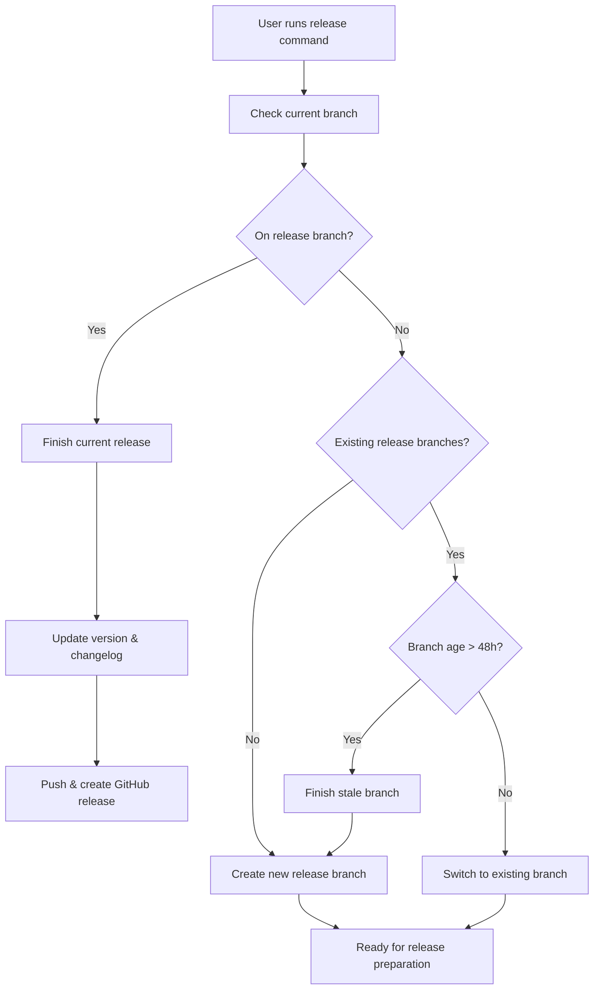

# Release Management

Gitflow release operations based on current branch state and semantic versioning.

## Workflow



## Branch-based Logic

### If on release branch
- Finish the current release
- Update version and changelog
- Merge to main/develop
- Create GitHub release
- Push all changes and tags

### If not on release branch
**Check for existing release branches:**
- **None found**: Create new release branch with semantic version bump
- **Branch exists < 48h**: Switch to existing branch for continued work
- **Branch exists > 48h**: Finish stale branch, then create new one

## Operations

### Finish Release
```bash
git flow release finish [version]
git push origin main develop --tags
gh release create v[version] --title "Release [version]" --latest
```

### Create New Release
```bash
# Auto-detect semantic version bump from commits
git flow release start [new-version]
git flow release publish [new-version]
```

### Continue Existing
```bash
git checkout release/[version]
```

## Semantic Version Management
- Automatically detect current version from git tags
- Analyze commits since last release:
  - **BREAKING CHANGE** or `feat!`/`fix!` → major bump
  - `feat:` commits → minor bump  
  - `fix:` commits → patch bump
- Update package.json/pyproject.toml/Cargo.toml if present
- Add changelog entry with current date

## Usage
```bash
# User modifies code, then runs:
release

# Command analyzes branch state and executes appropriate action
# No additional parameters needed - fully autonomous
```

## Best Practices
- Keep release branches short-lived (< 48h)
- Use conventional commits for automatic version detection  
- Test thoroughly on release branch before finishing
- Coordinate release timing with team
- Sync dependencies before finishing releases