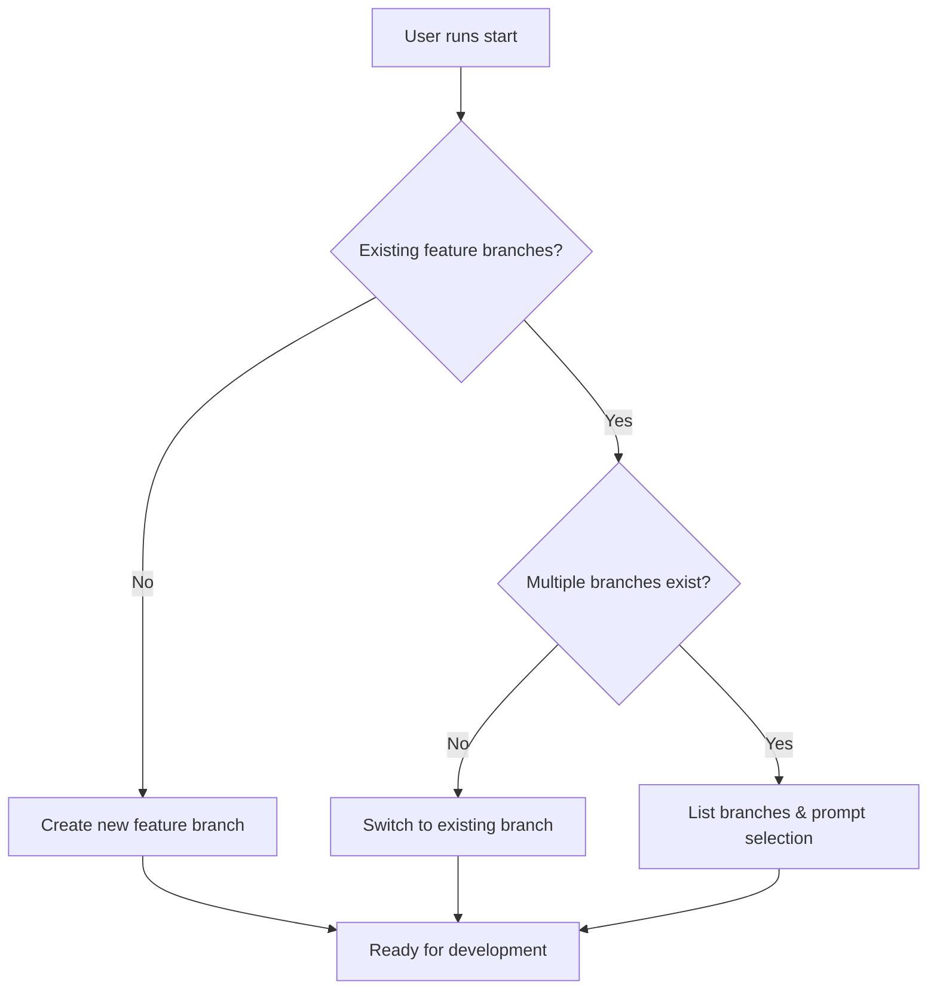

# Start GitFlow Feature

Start new features or continue existing feature development.

## Workflow



## Operations

### Create New Feature
```bash
# Auto-generate descriptive name or prompt user
# Creates feature branch from develop
git flow feature start [feature-name]
git flow feature publish [feature-name]
```

### Continue Existing Feature
```bash
# Switch to existing feature and sync with remote
git checkout feature/[feature-name]
git flow feature pull [feature-name]
```

## Feature Name Generation
- Automatically detect current work context from recent commits
- Use kebab-case naming: `user-authentication`, `payment-integration`
- Fallback to prompt user for descriptive name

## Branch Selection Logic
- **None found**: Create new feature branch from develop with descriptive name
- **Single branch**: Switch to existing branch and sync with remote
- **Multiple branches**: List all feature branches and prompt for selection

## Git-Flow Integration
- Features are created from develop branch
- Use `git flow feature pull` to sync remote changes
- Use `git flow feature publish` to share new features

## Best Practices
- Keep features small and focused (< 500 lines of code)
- Use conventional commits (feat:, fix:, chore:)
- Commit message titles must be lowercase and < 50 characters
- Regular commits with atomic, logical units of work
- Write tests as you develop features
