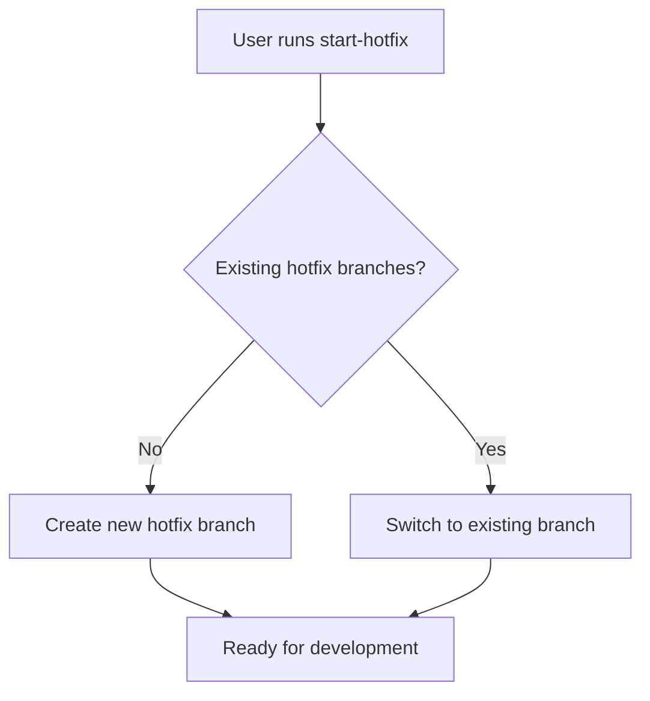

# Start GitFlow Hotfix

Start new hotfix or continue existing hotfix development.

## Workflow



## Operations

### Create New Hotfix
```bash
# Auto-increment patch version from latest tag
# Creates hotfix branch from main/master
git flow hotfix start [new-version]
```

### Continue Existing Hotfix
```bash
git checkout hotfix/[version]
```

## Version Management
- Automatically detect current version from git tags
- Increment patch version (1.2.3 → 1.2.4)
- Update package.json/pyproject.toml if present

## Branch Selection Logic
- **None found**: Create new hotfix branch from main/master with incremented patch version
- **Branch exists**: Switch to existing branch for continued work

## Git-Flow Integration
- Hotfixes are created from main/master branch (not develop)
- No publish command available for hotfixes in standard git-flow
- Version parameter is required for `git flow hotfix start`

## Best Practices
- Keep hotfixes focused on critical bug fixes only
- Use conventional commits (fix:, chore:)
- Commit message titles must be lowercase and < 50 characters
- Regular commits with atomic, logical units of work
- Test fixes thoroughly before finishing