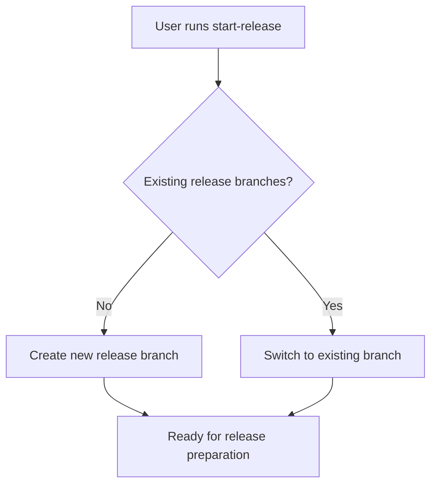

# Start GitFlow Release

Start new release or continue existing release development.

## Workflow



## Operations

### Create New Release
```bash
# Version parameter is required
# Creates release branch from develop
git flow release start [new-version]
git flow release publish [new-version]
```

### Continue Existing Release
```bash
git checkout release/[version]
```

## Semantic Version Management
- Automatically detect current version from git tags
- Analyze commits since last release:
  - **BREAKING CHANGE** or `feat!`/`fix!` → major bump
  - `feat:` commits → minor bump  
  - `fix:` commits → patch bump
- Update package.json/pyproject.toml/Cargo.toml if present

## Branch Selection Logic
- **None found**: Create new release branch from develop with semantic version bump
- **Branch exists**: Switch to existing branch for continued work

## Git-Flow Integration
- Releases are created from develop branch
- Version parameter is required for `git flow release start`
- Use `git flow release publish` to share release branch

## Best Practices
- Use conventional commits for automatic version detection  
- Test thoroughly on release branch before finishing
- Coordinate release timing with team
- Sync dependencies before finishing releases
- Regular commits with atomic, logical units of work
- Commit message titles must be lowercase and < 50 characters